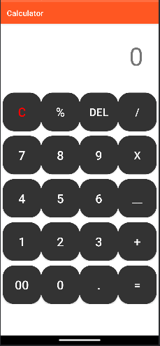

# 🎉 Calculator App - My First Android Project! 🎉

Welcome to my very first Android app – a **simple yet powerful Calculator** built using Java! 🚀

## 🌟 Project Journey

This project is a significant milestone in my journey as an Android developer. Here’s what I’ve explored and learned while building this calculator:

### 🛠️ **Layouts:**
- **RelativeLayout:** Perfect for positioning elements relative to one another.
- **LinearLayout:** Simplifies the alignment of UI elements in a single row or column.
- **ConstraintLayout:** Offers immense flexibility in designing complex layouts with constraints.

### 🎨 **Design Elements:**
- **TextView:** Displays results and messages on the screen with style.
- **EditText:** Allows users to input their calculations effortlessly.
- **Button:** Makes interaction smooth and intuitive by triggering actions with a tap.

### 💡 **Learning Curve:**
- **XML & Java Integration:** I delved into the world of XML for designing the interface and seamlessly connected these elements with Java code to handle user interactions and calculations.

## 📸 **Screenshot**

Here’s a sneak peek of what the app looks like:

## 🚀 What’s Next?

This project has sparked my enthusiasm for Android development, and I’m excited to dive deeper into creating more dynamic and feature-rich applications. Stay tuned for more projects and updates!

## 🙌 **Acknowledgments**

A big thank you to everyone who has supported me on this journey. Your encouragement has been invaluable!

Feel free to explore the code, and don’t hesitate to reach out if you have any questions or feedback. Happy coding! 🎉

---

*You can check out the code and contribute on [GitHub](https://github.com/Hami0095/Calculator).*

